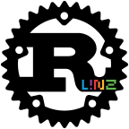

# Rust Meetup Linz

## Einleitung

*Rust* ist in den letzten Jahren zu einer beliebten Technologie geworden (vgl. [Stackoverflow Survey 2020](https://insights.stackoverflow.com/survey/2020#technology-most-loved-dreaded-and-wanted-languages)). Viele Entwicklerinnen und Entwickler sind neugierig auf die Sprache und würden gerne mehr darüber erfahren. Darum planen wir vom Coding Club Linz den Start eines Rust Meetups.

## Inhaltliche Schwerpunkte

Wie bei jedem Meetup geht es darum, Menschen, die ein Thema interessiert, zusammenzubringen. Bei Treffen werden Erfahrungen ausgetauscht, es wird Wissen weitergegeben, man spricht über aktuelle Entwicklungen etc. Dafür gibt es bei den Treffen kurze Vorträge bezogen auf Rust und verbundene Technologien (z.B. WebAssembly). Davor, danach und dazwischen ist Zeit zum informellen Plaudern vorgesehen.

Rust ist noch eine relativ junge Sprache und daher gibt es viele Personen, die erst wenig oder noch kein Wissen über Rust haben. Aus diesem Grund sind im Moment ausdrücklich Themen für Rust-Anfängerinnen und -Anfänger bei den Meetups willkommen. Vorträge über Grundlagen der Sprache Rust wären ein Beispiel dafür (können auch gerne von Personen gehalten werden, die selbst die Sprache erst erkunden). Es wird aber davon ausgegangen, dass Vortragende, Besucherinnen und Besucher fundierte Erfahrung in Sachen Softwareentwicklung haben und Rust nicht die erste Programmiersprache ist, die sie lernen.

## Treffen

Die Treffen werden bis auf weiteres wegen Covid-19 online stattfinden. Mittel- bis langfristig sind aber (auch) persönliche Treffen mit Livestreams geplant. Für Onlinemeetings werden die [Zoom-Lizenzen des Coding Club Linz](https://github.com/coderdojo-linz/coderdojo-online/blob/master/Zoom.md) verwendet.

## Offene Fragen, Diskussionspunkte

### Kommunikationsplattform

Für die Linzer Rustaceans soll es auch zwischen den Treffen eine Möglichkeit geben, in Kontakt zu bleiben. Details TBD. Möglichkeiten:

* Discord Server
* Slack

### Sprache

Es soll möglichst vielen, interessierten Personen ermöglicht werden, am Meetup teilzunehmen. Erreichen wir dieses Ziel besser mit Kommunikationssprache Deutsch oder Englisch? Sind Mischformen möglich/sinnvoll? Betroffene Themengebiete:

* Webseite
* Social Media, Newsletter
* Moderationssprache
* Vortragssprache

Vorschlag: Generell Englisch (Webseite, schriftliche Kommunikation nach außen), Vortragende können gerne Deutsch sprechen, wenn ihnen das lieber ist.

## Diverse, organisatorische Themen

### Logo-Entwurf

Anmerkung: Bitte um Verbesserung wurde bereits an befreundeten Designer geschickt.

### Domain

Die Domain *rust-linz.at* wurde für das Meetup bereits gekauft.

### Taskliste

In diesem Repository werden die Aufgaben für den Start des Rust Linz Meetups als [GitHub Issues](https://github.com/coding-club-linz/rust-meetup-concept/issues) verwaltet.
